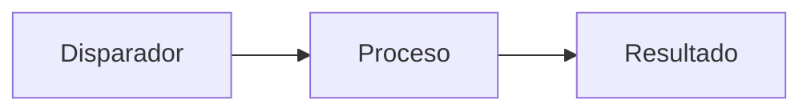

[← Volver a automations](../README.md)

# Nombre del proyecto

> Una línea: qué problema resuelve.

<!--  -->

## Contexto

Dónde y cuándo lo hiciste (proyecto personal, práctica en X, freelance). Si es de una empresa, aclara que es una versión sanitizada.

## Problema

Qué pasaba antes: proceso manual, tiempo perdido, errores.

## Solución

Qué construiste y cómo funciona.



## Tecnologías

n8n · ...

## Cómo ejecutarlo

```bash
cd automations/nombre-del-proyecto
cp .env.example .env
```

## Resultados

- Ahorro de X horas por semana
- X procesos automatizados

## Lo que aprendí

- ...
