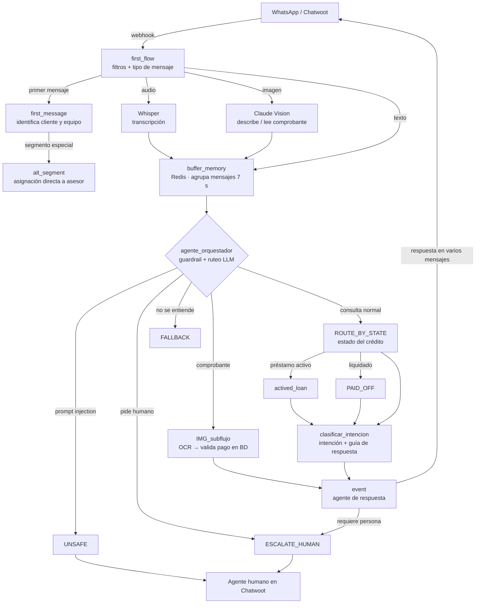
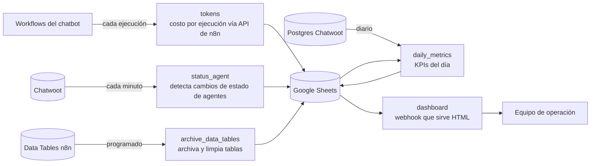

[← Volver a automations](../README.md)

# Agente conversacional de cobranza para WhatsApp (n8n + LLMs)

> Chatbot multi-agente que atiende a clientes de una fintech de préstamos por WhatsApp: entiende texto, audio e imágenes, detecta intentos de manipulación, consulta el estado del crédito del cliente y responde o escala a un agente humano.

     

**[Ver demo del dashboard de operación →](https://santiagocheluja124.github.io/automations/n8n-chatbot-cobranza/dashboard-demo/)** (datos ficticios)

<!-- Agrega aquí una captura del canvas de n8n o un GIF de la conversación -->
<!--  -->

## Contexto

Desarrollado durante mi práctica como *Intern – Data & Automation* (2025–2026). Esta es una **versión sanitizada**: se eliminaron credenciales, dominios, IDs internos, datos de clientes y la marca de la empresa (reemplazada por "FinDemo"). La lógica y la arquitectura son las de producción.

## Problema

El equipo de cobranza recibía cientos de mensajes diarios por WhatsApp. La mayoría eran preguntas repetitivas (¿cuánto debo?, ¿a qué cuenta pago?, ya pagué), mezcladas con comprobantes en foto, notas de voz, spam y casos que sí necesitaban a una persona. Todo se atendía manualmente.

## Solución

Un sistema de **19 workflows** en n8n con dos partes: el pipeline de agentes que atiende a los clientes y un módulo de monitoreo que mide su desempeño.

### 1. Pipeline del chatbot



### 2. Monitoreo y dashboard de operación



- **Costo de IA por conversación.** Después de cada ejecución, `tokens` consulta la API de la propia instancia de n8n, suma los tokens que usó cada modelo (OpenAI y Anthropic) y calcula el costo en USD.
- **Disponibilidad del equipo.** `status_agent` consulta Chatwoot cada minuto y solo registra los *cambios* de estado (en línea → desconectado), con lo que después se calculan las horas conectadas por agente.
- **KPIs diarios.** `daily_metrics` combina SQL sobre la base de Chatwoot con los registros del bot: cobertura del bot, escalamientos reales, conversaciones ignoradas, cierres por bot/humano/sistema y carga por agente. Incluye una conciliación (`entradas = bot + humano + sin asignar`) para validar que las cifras cuadren.
- **Dashboard sin servidor extra.** Un webhook de n8n devuelve una página HTML con Chart.js y los datos embebidos; con `?format=json` devuelve solo los datos para refrescar sin recargar.

### Puntos técnicos del chatbot

- **Buffer anti-ráfagas con Redis.** Los usuarios mandan "hola" / "una pregunta" / "cuánto debo" en tres mensajes. Cada mensaje entra a una lista en Redis, espera 7 s y solo el último de la ráfaga continúa, con todos los textos consolidados. Esto evita respuestas duplicadas y reduce llamadas al LLM.
- **Guardrail de seguridad.** Antes de responder, un LLM orquestador clasifica el mensaje: intento de *prompt injection* o jailbreak (UNSAFE), solicitud de humano, mensaje ininteligible o consulta válida. Un filtro previo con expresiones regulares resuelve los casos obvios sin gastar tokens.
- **Entrada multimodal.** Notas de voz se transcriben con Whisper; imágenes se analizan con Claude Vision. Si la imagen es un comprobante de transferencia, se extraen CLABE, monto y fecha y se valida contra la base de datos de pagos.
- **Ruteo por estado del cliente.** Se consulta PostgreSQL para saber si el cliente tiene préstamo activo, ya liquidó o no existe, y se arma un contexto específico (pago semanal, atraso, promesas de pago, descuentos vigentes) para el agente de respuesta.
- **Clasificación de intención** (pago, flexibilidad, descuento, dispersión, consulta de datos, escalar, general) para dirigir la respuesta y etiquetar la conversación.
- **Escalamiento a humanos** con asignación ponderada entre agentes, cambio de estado de la conversación y etiquetas en Chatwoot. Las escalaciones se registran en Google Sheets.
- **Respuestas naturales.** El agente final divide respuestas largas en varios mensajes con pausas entre ellos, como escribiría una persona.
- **Trazabilidad.** Estado de conversación en Data Tables de n8n y registro de consumo de tokens por ejecución.

## Tecnologías

n8n · OpenAI (GPT, Whisper) · Anthropic (Claude Haiku, visión) · Redis · PostgreSQL · Chatwoot API · Twilio · Google Sheets · JavaScript · Chart.js · Python (scripts)

## Estructura del repo

```
├── workflows/
│   ├── 01-15_*.json        # pipeline del chatbot, en orden
│   └── 20-23_*.json        # monitoreo y dashboard
├── docs/
│   └── WORKFLOWS.md        # catálogo: nodos, sub-flujos y credenciales de cada uno
├── scripts/
│   ├── sanitize.py               # limpia exportaciones de n8n antes de publicarlas
│   └── build_dashboard_demo.py   # genera la demo en ../docs/ (GitHub Pages del repo)
├── docker-compose.yml   # n8n + Redis + Postgres para correrlo local
└── .env.example
```

## Cómo ejecutarlo localmente

```bash
git clone https://github.com/SantiagoCheluja124/automations.git
cd automations/n8n-chatbot-cobranza
cp .env.example .env          # completa tus valores
docker compose up -d

# importar todos los workflows (conserva los IDs, así los sub-flujos quedan enlazados)
docker compose exec n8n n8n import:workflow --separate --input=/workflows
```

Después, en http://localhost:5678:

1. Crea las credenciales que pide cada workflow (ver `docs/WORKFLOWS.md`) y asígnalas a los nodos marcados en rojo.
2. Crea las Data Tables `conversation_state` y `escalation_log` y selecciónalas en los nodos correspondientes (marcados `CONFIGURE_ME`).
3. Apunta el webhook de Chatwoot a `http://TU_HOST:5678/webhook/chatwoot-incoming`.
4. El dashboard queda en `http://TU_HOST:5678/webhook/dashboard`.

> Las consultas SQL dependen del esquema de la empresa, así que el flujo completo no corre sin una base de datos equivalente. Se incluyen para mostrar la lógica.

## Resultados

<!-- Pon números reales aunque sean aproximados -->
- Mensajes atendidos sin intervención humana: **X %**
- Tiempo de primera respuesta: de **X min** a **X s**
- Conversaciones escaladas correctamente a cobranza: **X / día**

## Lo que aprendí

- Diseñar flujos de agentes con responsabilidades separadas (seguridad, ruteo, respuesta) en lugar de un solo prompt gigante.
- Controlar costos de LLM con filtros deterministas antes del modelo y agrupando mensajes.
- Manejar concurrencia en un sistema de mensajería (condiciones de carrera en el buffer).
- Medir un sistema de IA en producción: costo por conversación, cobertura y calidad del escalamiento, no solo "que responda".
